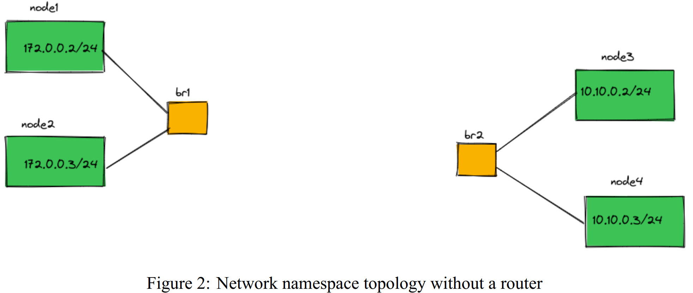

## Q1. Topology Creation


*Figure 1: Network namespace topology with a router*

To create the topology shown in `figure1.png`, run the `create_topo.sh` script:

```bash
cd Problem\ 1
sudo chmod +x create_topo.sh
sudo ./create_topo.sh
```

> **Note:**  
> The script clears all existing links and network namespaces before creating the new topology.

To ping nodes, use the `ns_ping.sh` script:

```bash
sudo chmod +x ns_ping.sh
sudo ./ns_ping.sh <src-ns> <dst-ns> [ping-count]
```

---

## Q2. Communication Without the "router" Namespace


*Figure 2: Network namespace topology without a router*

Before proceeding, remove the `router` namespace:

```bash
sudo ip netns delete router
```

After creating the topology:

1. **Assign IP addresses** from the root namespace to the bridges (`br1`, `br2`) using the previous default gateway:
```bash
sudo ip addr add 172.0.0.1/24 dev br1
sudo ip addr add 10.10.0.1/24 dev br2
```
2. **Enable IP forwarding** in the root namespace:

    ```bash
    sudo sysctl -q -w net.ipv4.ip_forward=1
    ```

OR, to automate all the above steps, simply run the `remove_router.sh` script:
```bash
sudo ./remove_router.sh
```

Now, nodes from different subnets can communicate with each other through the root namespace, even without the `router` namespace.

---

## Q3. Communication Between Servers (node1, node2 & node3, node4) with L2 Switch


*Figure 3: Two servers, each with two namespaces connected to local bridges, interconnected via an L2 switch*

### Scenario

- **Server 1:**  
  - Namespaces: `node1` (172.0.0.2/24), `node2` (172.0.0.3/24)  
  - Both connected to `br1` (bridge on Server 1)

- **Server 2:**  
  - Namespaces: `node3` (10.10.0.2/24), `node4` (10.10.0.3/24)  
  - Both connected to `br2` (bridge on Server 2)

- **Interconnection:**  
  - `br1` and `br2` are each connected to an L2 switch, which links Server 1 and Server 2 at Layer 2.

### How do these two servers communicate across different subnets, given they share an L2 switch?
1. **Bridging at Layer 2**
   - Both `br1` and `br2` are layer‑2 devices and by default forward Ethernet frames based on MAC addresses.
   - Even though the namespaces on each bridge live in different IP subnets, the L2 switch blindly switches frames between the bridges as long as they share a VLAN.
   - However, IP packets destined for a different subnet will require a router (L3) process to forward them.

2. **Introducing a Default Gateway on Each Bridge**
   - Assign each bridge a virtual IP (e.g., `172.0.0.1/24` on `br1` and `10.10.0.1/24` on `br2`).
   - Configure each namespace to use its bridge as the default gateway.
   - Deploy a routing entity (on each server or centrally) that holds both virtual IPs and can route between them. This can be:
     - A Linux router namespace.
     - An Open vSwitch (OVS) instance with IP-enabled bridge ports.

3. **Using OpenFlow Control on the Switch**
   - If the physical L2 switch supports OpenFlow or an SDN controller, you can program flow rules to:
     - Match on IP source and destination prefixes.
     - Rewrite MAC addresses as needed (e.g., proxy ARP or NAT).
     - Forward packets from `br1` to `br2` even across different subnets at layer‑2.

4. **Connecting the Switch Interface Directly into the Bridge**
   - Attach the switch-facing interface as a port of the Linux bridge:
     ```sh
     brctl addif br1 ethX
     brctl addif br2 ethY
     ```
   - Optionally, assign an IP on that interface for management or routing.
   - Use the switch’s management plane or OpenFlow to steer cross‑subnet traffic through specific bridge ports.

**Summary**: By default, L2 switches do not route IP between subnets—they only forward based on MAC. To achieve inter‑subnet communication:
- Deploy a router function (Linux or OVS) on the servers to handle IP forwarding.
- Or leverage SDN/OpenFlow to program the switch to rewrite and forward IP packets across bridges.

---

